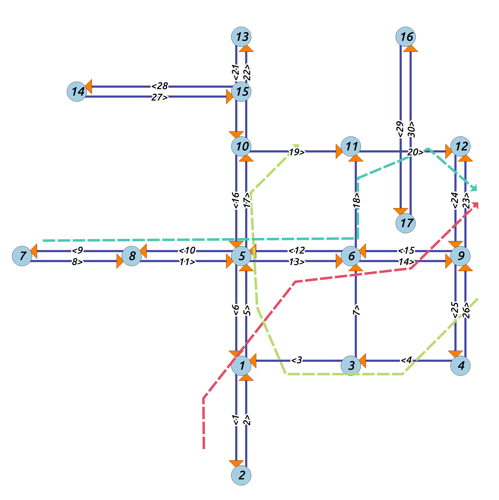

## Structure

- Input data
    + ubodt_config.xml: configuration for precomputation
    + fmm_config.xml: configuration for map matching
    + data folder: GPS trajectory file (trips.shp) and network file (edges.shp)
- Output data
    + ubodt.txt: an upper bounded origin-destination table in CSV format
    + mr.txt: the map matching result in CSV format

## Road network and GPS trajectories

## Run map matching

To run the map matching, change to `example` folder

    cd example

### Step 1. Generate an upper-bounded origin destination table from the network shapefile.

Run UBODT generator with the provided configuration file:

    ubodt_gen ubodt_config.xml

A new UBODT file `ubodt.txt` will be generated.

### Step 2. Run map matching with UBODT

Add `ubodt.txt` to the map matching configuration file `fmm_config.xml`.

Run the `fmm` application with:

    fmm fmm_config.xml

A matched result file will be generated as `mr.txt`, which is a CSV file and the `c_path` column contains the matched path information, for details see the [output section](https://github.com/cyang-kth/fmm/wiki/Input-and-output#output-of-fmm). 

## Matching result

